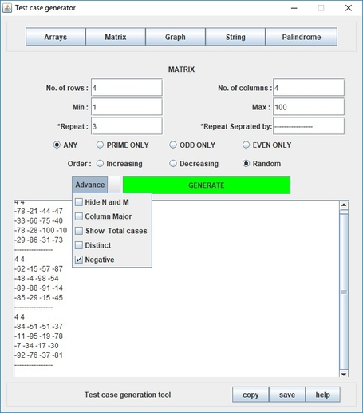
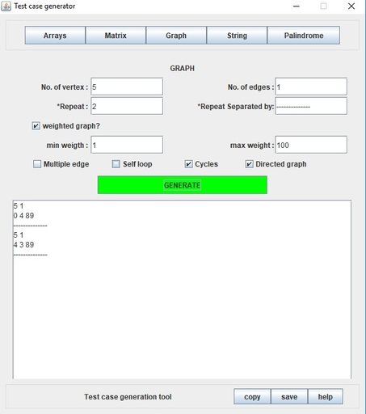
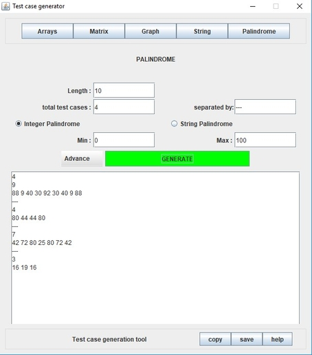
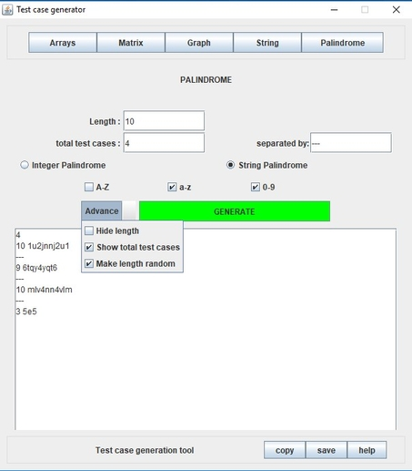

<h1>Test Case Generator</h1>
Desktop application to generate Array, String, Matrix, Graph and Palindrome test cases for debugging.
<h2>Getting Started</h2>
These instructions will get you a copy of the project up and running on your local machine for development and testing purposes. See deployment for notes on how to deploy the project on a live system.

<h3>Prerequisites</h3>
What things you need to install the software and how to install them.

```
JRE
```
<h3>Installing</h3>

+ [Download](https://sourceforge.net/projects/test-case-generator-tool/) and run the JAR file
+ For more information follow this [link](http://www.bambootree.in/test-case-generator.html)

<h2>Built With</h2>

```
Swing
```

<h2> How to use it ? </h2>

<h3> Strings </h3>


By selecting strings, here you can find a number of tools to generate random strings of your preferences. You can generate any number of strings of any size with repeat and total count text fields as well as manage as how they are separated. Sort the characters in your desired order. You can select the various combinations of input cases such as strings containing A-Z, 0-9,a-z etc. Choose from our advanced panel for negative outputs, distinct characters in the string and other options such as show total number of string, hide each strings length and random length of strings. 

<h3> Matrix </h3>



By selecting matrix, here you can find a number of tools to generate random matrices of your preferences. You can generate any number of matrix of any dimension with repeat and total count text fields as well as manage as how they are separated. Choose from our advanced panel for negative outputs, distinct elements in a matrix and other options such as show total number of matrix, hide each matrix dimension and make each column wise arranged. 

<h3> Graphs </h3>



By selecting graphs, here you can find a number of tools to generate random graphs of your preferences. You can generate any number of graphs with any no of vertices and edges with the repeat, vertex and edges text field. You can select if the graph is weighted (and specify weight ranges) or not by checking the weighted graph option. Advanced options include Multiple Edges, self-loop, cycles and directed graph.    

<h3> Arrays </h3>


By selecting arrays, here you can find a number of tools to generate random arrays of your preferences. You can generate any number of arrays of any size with repeat and total count text fields as well as manage as how they are separated. Choose from our advanced panel for negative outputs, distinct elements in an array and other options such as show total number of arrays  , hide each array length and make each array of random length. 	

<h3> Integer Array Palindromes </h3>


 
By selecting palindromes, here you can find a number of tools to generate random strings and integer palindromes of your preferences. You can generate any number of integer array palindromes of any size with repeat and total count text fields as well as manage as how they are separated. You can specify the ranges with min and max fields. Choose from our advanced panel for options such as show total number of arrays, hide each arrays length and random length of arrays.

<h3> String Palindromes </h3>


 
By selecting palindromes, here you can find a number of tools to generate random strings and integer palindromes of your preferences. You can generate any number of strings palindromes of any size with repeat and total count text fields as well as manage as how they are separated. You can select the various combinations of input cases such as strings containing A-Z, 0-9, a-z etc. Choose from our advanced panel for options such as show total number of string, hide each strings length and random length of strings palindromes.


<h3> Copy to Clipboard </h3>

To Copy the text from the TextArea, simply click the “copy” Button and the text gets copied to the keyboard. 

<h3> Save to File </h3>

To save the text from the TextArea to an external file, simply click the “save to file” Button and the text gets copied to the keyboard. The file gets saved as “input.txt” in the same folder as the application. 

<h3> Help </h3>

To get help at any point of time, click the “Help” button.


To contact us for any query or feedbacks, simply drop a mail at – <br>
avinashkr226@gmail.com <br>
snehmishra555@gmail.com 


<h3>Authors</h3>

[Avinash Kumar](https://github.com/akisonlyforu/)

[Sneh Kumar Mishra](https://github.com/sneh-m/)
<h2>License</h2>
This project is licensed under the MIT License - see the LICENSE.md file for details
